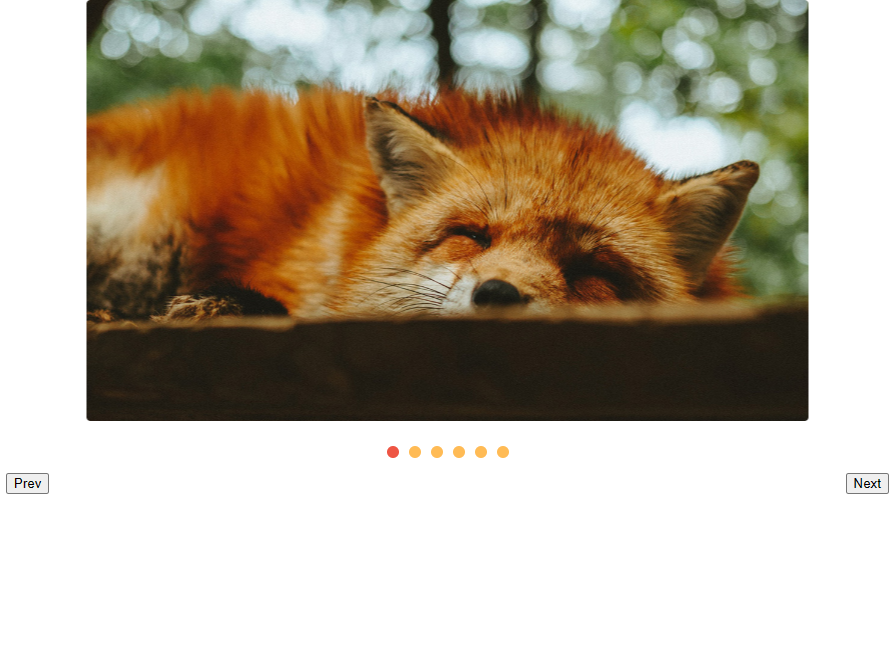
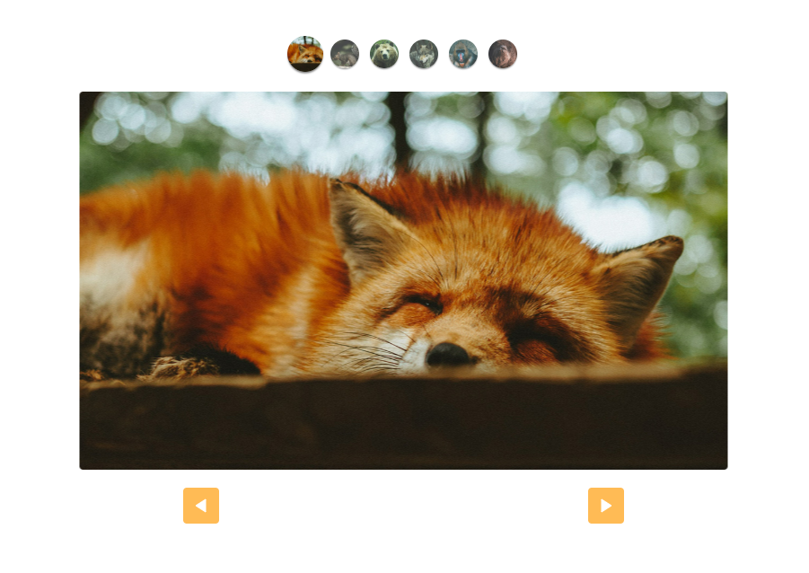

# Slide

## About

Slide is a simple slide component that allows you to create slideshows on your website. It provides a convenient way to display images or content in a visually appealing manner. This component was developed as part of a JavaScript course to demonstrate practical usage of JavaScript concepts.

## Usage

To use the Slide component, follow these steps:

1. Download the necessary files and include them in your project.
2. Create an HTML container element where you want the slide to be displayed.
3. Add the necessary CSS classes and styles to the container element.
4. Initialize the Slide component using JavaScript and pass in the required configuration options.
5. Customize the slide by adding content or images to each slide item.
6. Optionally, add custom index controls to navigate through the slides.

## Examples

### Slide without custom controls

This example shows the basic usage of the Slide component without any custom index controls. The slides are automatically navigated through using the default controls provided by the component.

### Slide with custom controls

In this example, custom index controls are added to the Slide component. These controls allow the user to manually navigate through the slides by clicking on the index indicators. To use custom index controls, pass the corresponding CSS class when using the `addControl` function. If no custom class is passed, the default control will be used.

## Customization

The Slide component can be further customized by modifying the CSS classes and styles provided. You can adjust the appearance, size, transitions, and other visual aspects to match your website's design.

## License

This Slide component is open source and released under the [MIT License](LICENSE). Feel free to modify and use it in your projects.

---

Feel free to use the provided examples and documentation to incorporate the Slide component into your website. If you have any questions or need further assistance, please don't hesitate to reach out.

Enjoy creating engaging slideshows with the Slide component!
